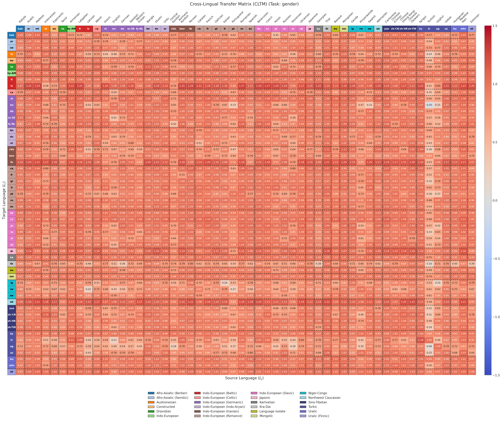
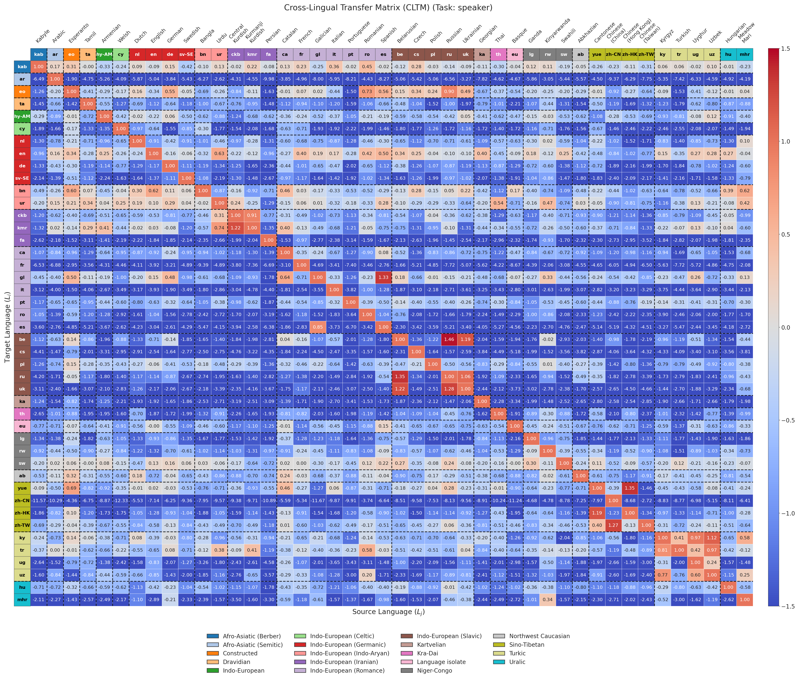
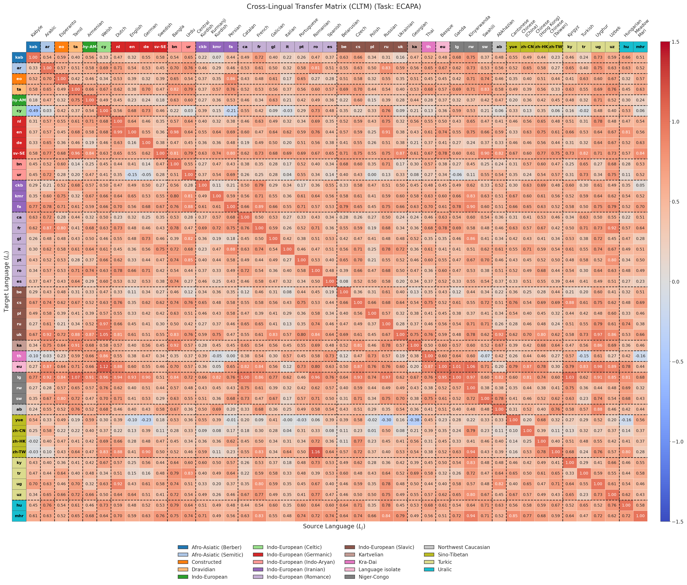
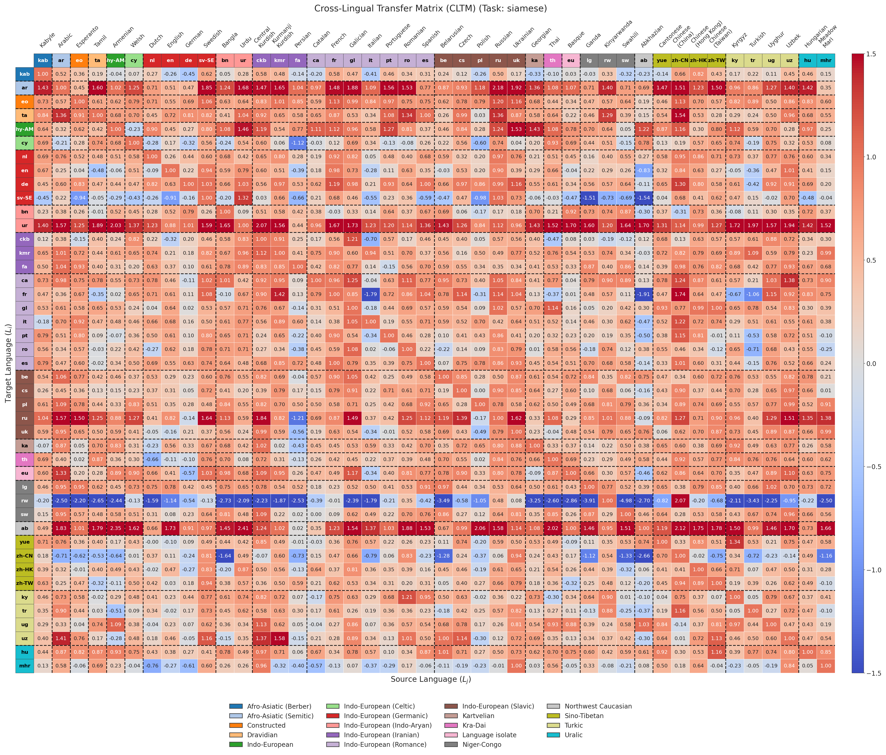
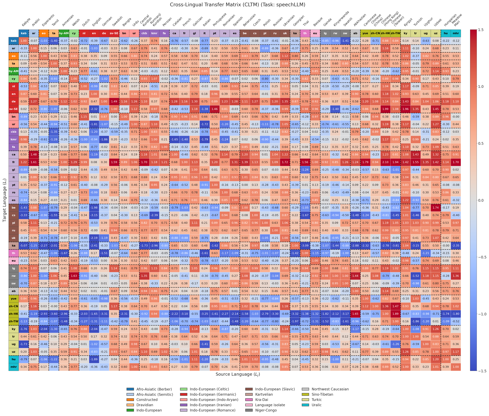
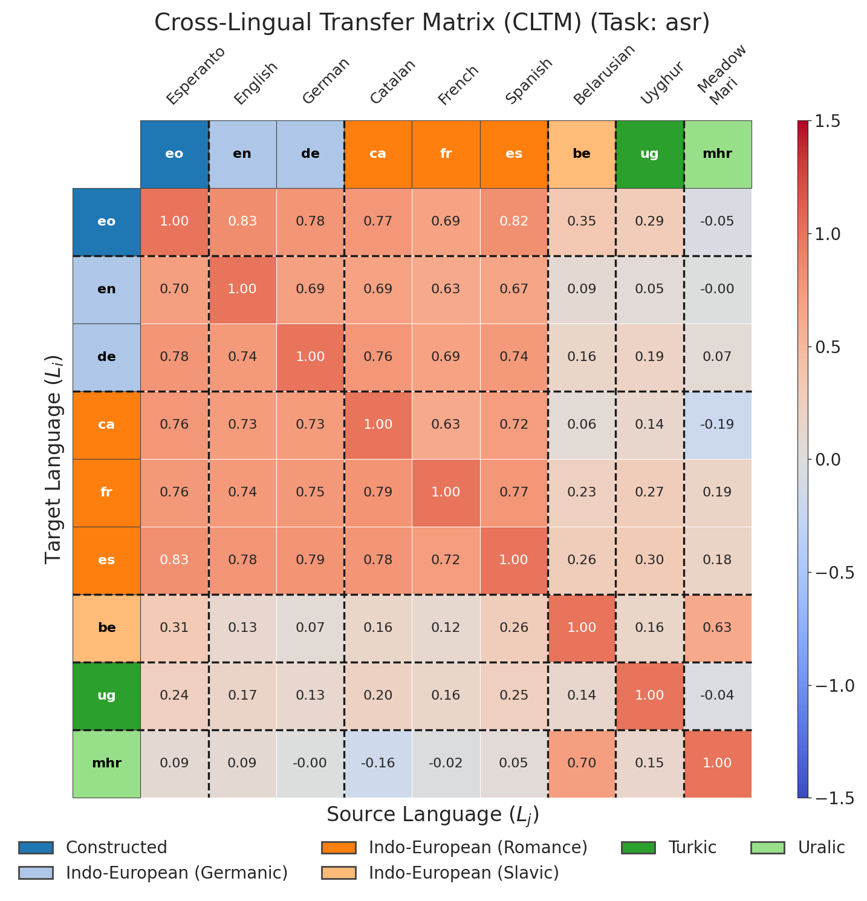

# CLTM Framework: Cross-Lingual Transfer Analysis for Speech Processing

This repository contains the code and experimental framework developed for the Master’s Thesis:

**“On the Language-Agnostic Nature of Speech Processing Tasks”**
Pol Buitrago Esteve
MSc in Advanced Telecommunication Technologies (MATT)
Universitat Politècnica de Catalunya (UPC), 2026

The project introduces the **Cross-Lingual Transfer Matrix (CLTM)**, a general and task-agnostic framework for systematically analyzing cross-lingual transfer effects in speech processing.

---

## Overview

Multilingual speech models often rely on cross-lingual data transfer to compensate for data scarcity in low-resource languages. However, transfer effects are highly task- and language-dependent, and there is no unified methodology to quantify or compare these effects across tasks.

This framework addresses that gap by:

* Defining a **pairwise, quantitative measure of cross-lingual transfer**
* Applying it consistently across **heterogeneous speech tasks**
* Enabling **task-level characterization of language dependence**

The CLTM captures how adding data from a donor language affects performance on a target language under controlled experimental conditions.

---

## Tasks Covered

The framework is evaluated on three representative speech processing tasks:

* **Gender Identification** (paralinguistic)
* **Speaker Verification** (paralinguistic)
* **Automatic Speech Recognition (ASR)** (linguistic)

This combination allows direct comparison between linguistic and paralinguistic tasks in terms of language dependence.

---

## Architectures Used

### Gender Identification

* **mHuBERT-147** (src/HuBERT/gender): massively multilingual self-supervised speech model, fine-tuned for gender classification.

### Speaker Verification

1. **mHuBERT-147 (SID-based embeddings)** (src/HuBERT/speaker & speaker-no-validation)
   Pretrained HuBERT encoder fine-tuned with a speaker identification objective. Embeddings are L2-normalized; classification head discarded after training.

2. **ECAPA-TDNN** (src/ECAPA)
   Time-delay neural network generating fixed-dimensional speaker embeddings from acoustic features. Optimized with AAM-Softmax and cross-entropy loss.

3. **Siamese Network** (src/siamese)
   Learns speaker embeddings via pairwise similarity optimization using contrastive loss. Shared-weight network processes pairs of utterances.

4. **SpeechLLM** (src/speechLLM)
   Large pretrained speech model generates embeddings; pairwise representations fed into a lightweight MLP classifier with sigmoid cross-entropy to predict same-speaker probability.

### Automatic Speech Recognition (ASR)

* **mHuBERT-147** (src/HuBERT/asr): fine-tuned for transcription across multiple languages using Mozilla Common Voice datasets.

---

## CLTM Matrices

The CLTM matrices illustrate **cross-lingual transfer effects** for all tasks and architectures. All images are included below for immediate reference.

### Gender Identification (mHuBERT)



### Speaker Verification

* **mHuBERT (SID-based embeddings)**
  

* **ECAPA-TDNN**
  

* **Siamese Network**
  

* **SpeechLLM**
  

### ASR (mHuBERT)



> All matrices are automatically generated from experimental outputs in `src/*/outputs/` and are ready for direct inspection or inclusion in publications.

---

## Methodology

* Controlled fine-tuning with:

  * Fixed data regimes
  * Multiple random seeds
  * Deterministic training outside seeded randomness
* Automatic computation of:

  * Cross-Lingual Transfer Matrices (CLTM)
  * Aggregated and task-level transfer metrics
* Graph-based and geometric analyses for interpretability
* Experiments isolate the effect of donor-language data while controlling for confounding factors such as data volume and initialization

---

## Repository Structure

```
cltm-framework/
├── src/
│   ├── CLTM/                 # CLTM computation, utilities, figures
│   ├── HuBERT/               # mHuBERT pipelines (asr, gender, speaker, speaker-no-validation)
│   ├── ECAPA/                # ECAPA-TDNN speaker verification pipeline
│   ├── siamese/              # Siamese network speaker verification pipeline
│   ├── speechLLM/            # SpeechLLM speaker verification pipeline
│   ├── outputs/              # Experiment outputs (metrics, logs, matrices)
│   └── __pycache__/
├── scripts/
│   ├── data/
│   ├── examine.py
│   ├── interval/
│   ├── labels/
│   ├── results/
│   ├── tools/
├── backyard/                  # Development, exploratory, and scratch experiments
├── data/                      # Raw datasets (excluded from repo)
├── hf_cache/                  # HuggingFace cache (excluded from repo)
└── README.md
```

> **Note:** Raw datasets (`data/`) and HuggingFace cache (`hf_cache/`) are excluded due to size and licensing constraints.

---

## Reproducibility

* All experiments are seed-controlled
* Configurations are fully logged
* CLTM computation is deterministic given fixed inputs
* Results can be reproduced by rerunning the same configuration files

Experiments were executed on the **MareNostrum 5 supercomputer** at the Barcelona Supercomputing Center (BSC), using GPU clusters managed via SLURM.

---

## Citation

If you use this framework or the CLTM methodology in your research, please cite.

---

## License

This project is licensed under the **Creative Commons Attribution 4.0 International License** (CC BY 4.0).

Proper attribution is required:
**Pol Buitrago Esteve** – [https://github.com/Pol-Buitrago](https://github.com/Pol-Buitrago)

[Official license page](https://creativecommons.org/licenses/by/4.0/)

---

## Contact

**Pol Buitrago Esteve**
GitHub: [https://github.com/Pol-Buitrago](https://github.com/Pol-Buitrago)

---

¿Quieres que haga eso?
